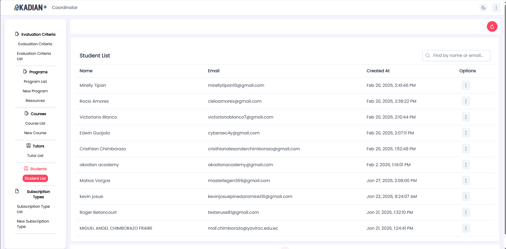
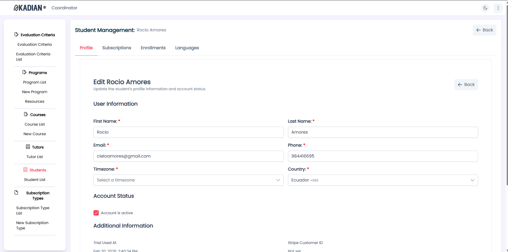
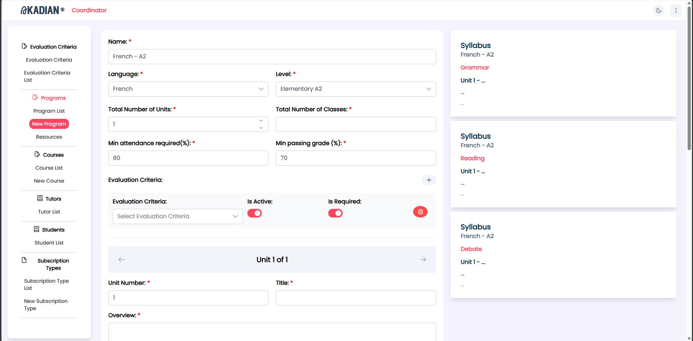
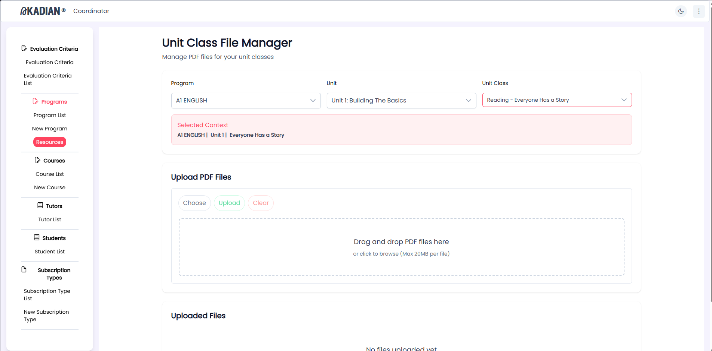
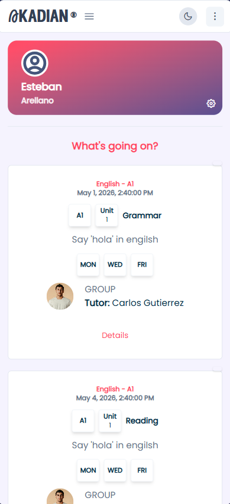
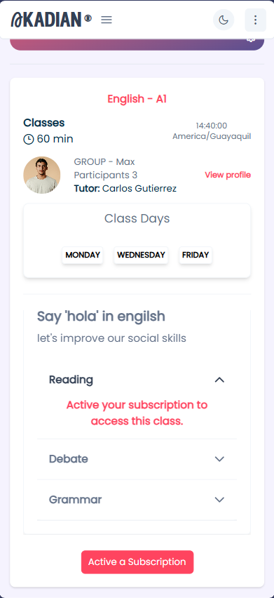
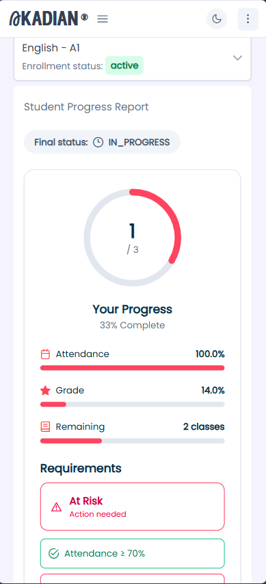
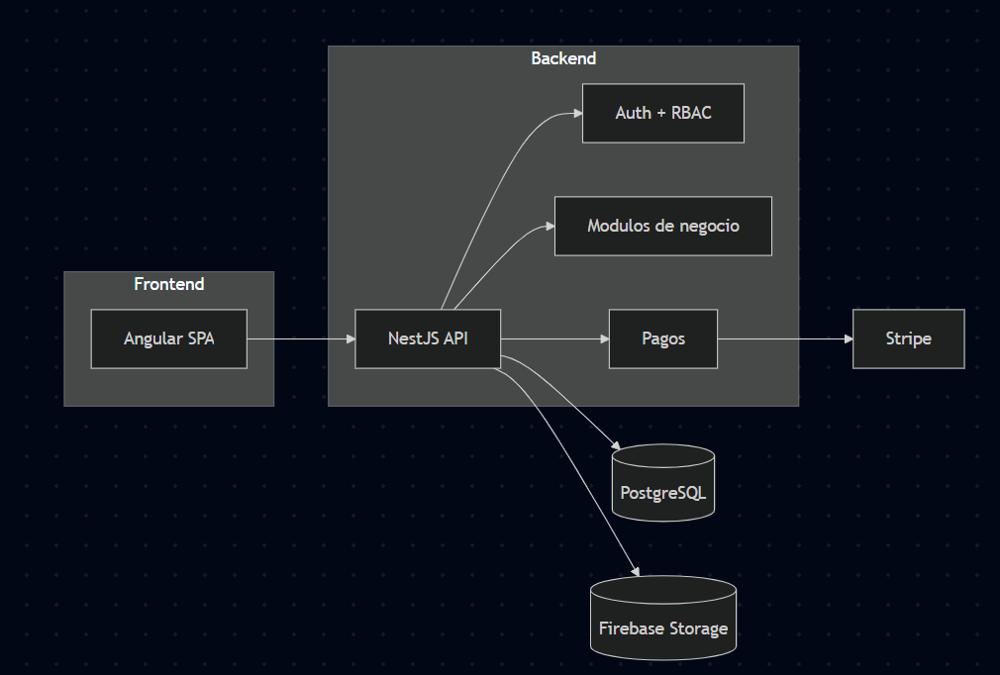
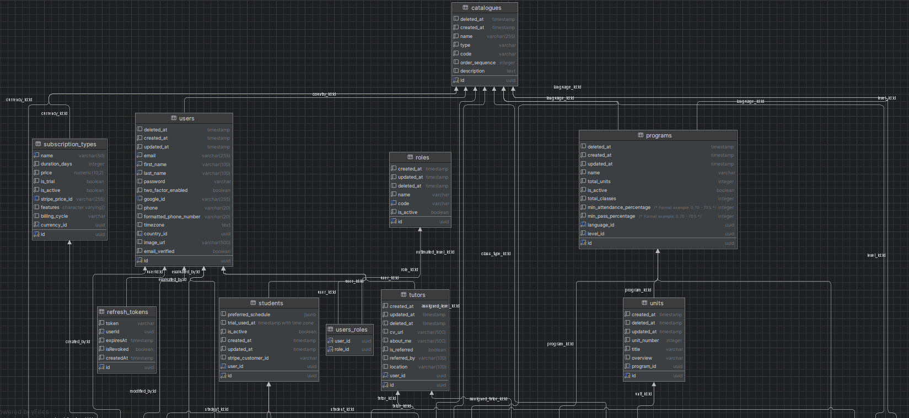
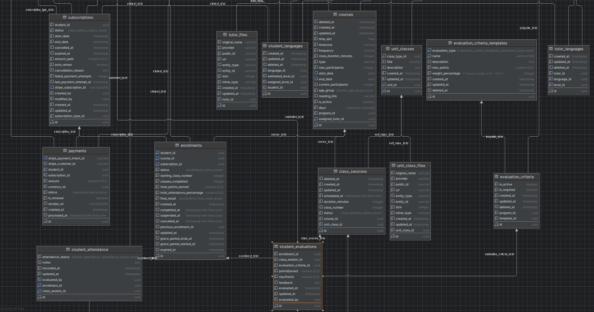

# Akadian Showcase

Akadian is an academic platform that manages classes, users, roles, and payments in a unified flow.
It combines teaching operations, administration, and subscriptions in a single system.

**Stack**

- Angular
- NestJS
- PostgreSQL
- Stripe

## 📸 Screenshots

**Coordinator dashboard**

**Coordinator student management**

**Coordinator new program**

**Coordinator file manager**

**Student main page**

**Student course page**

**Student progress page**

## 🏗️ Architecture

**ERD (database)**

**Key notes**

- Clear frontend/backend separation for independent deployment and scaling.
- Modular NestJS architecture for domains like users, classes, subscriptions, and payments.
- Role-based authentication (RBAC) to separate admin, tutor, and student flows.
- Stripe integration for charges, subscription states, and webhooks.

## ⚙️ Features

- Roles and permissions (admin, tutor, student)
- Class, session, and attendance management
- Subscriptions and recurring payments
- Admin panel with catalogs and reports

## 🧪 Technical decisions

- **NestJS** for its modular architecture and alignment with DDD for domain growth.
- **Database design** normalized with versioned migrations to avoid drift.
- **Stripe webhooks** to keep payment state and user access in sync.
- **DigitalOcean Spaces** for files and evidence without overloading the core API.

## 🔒 Code note

The full source code is private due to project scope, but selected modules and architectural samples are included in this repository. Full access can be granted upon request.

